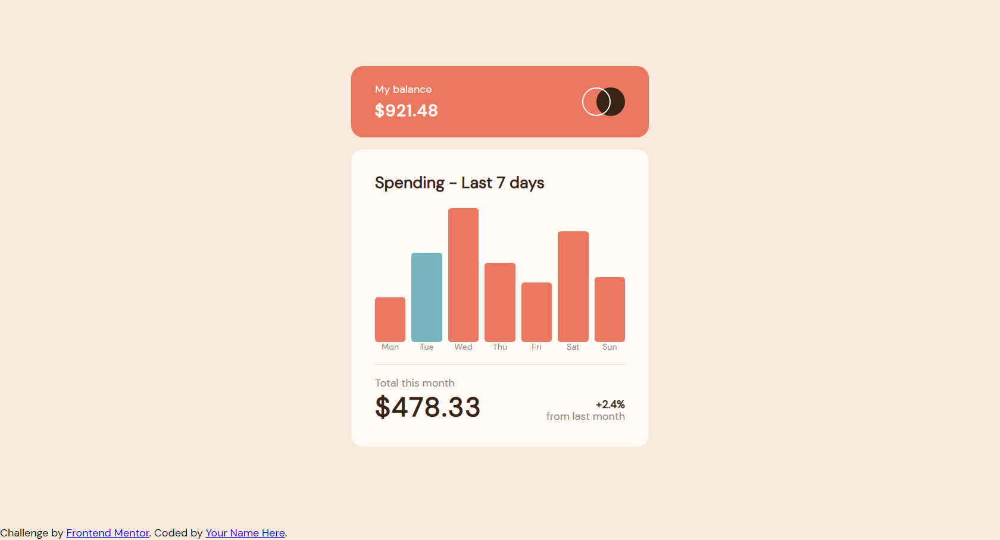
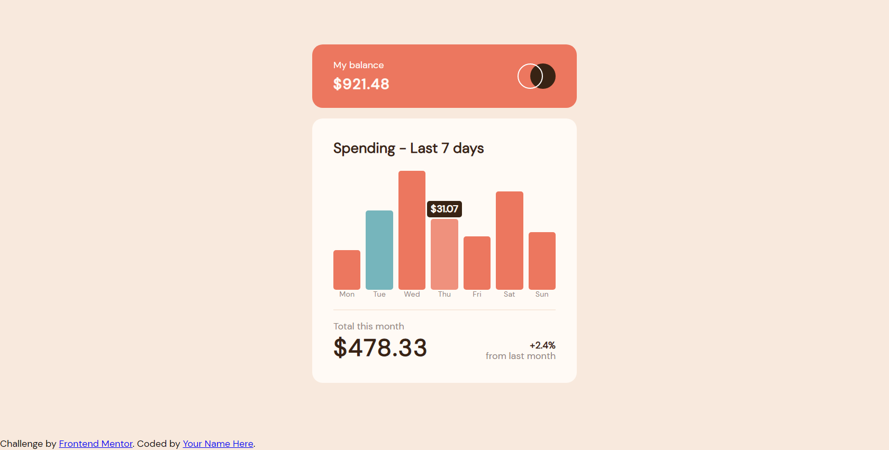

# Frontend Mentor - Expenses chart component solution

This is a solution to the [Expenses chart component challenge on Frontend Mentor](https://www.frontendmentor.io/challenges/expenses-chart-component-e7yJBUdjwt). Frontend Mentor challenges help you improve your coding skills by building realistic projects. 

## Table of contents

- [Overview](#overview)
  - [The challenge](#the-challenge)
  - [Screenshot](#screenshot)
  - [Links](#links)
- [My process](#my-process)
  - [Built with](#built-with)
  - [What I learned](#what-i-learned)
- [Author](#author)

## Overview

### The challenge

Users should be able to:

- View the bar chart and hover over the individual bars to see the correct amounts for each day
- See the current day’s bar highlighted in a different colour to the other bars
- View the optimal layout for the content depending on their device’s screen size
- See hover states for all interactive elements on the page
- **Bonus**: Use the JSON data file provided to dynamically size the bars on the chart

### Screenshot
### Desktop View

### Mobile View:

### Links

- Solution URL: [solution URL here]()
- Live Site URL: [live site URL here](https://aymenfisher.github.io/expenses-chart-component)

## My process

### Built with

- Semantic HTML5 markup
- CSS custom properties
- Flexbox
- CSS Grid
- Responsive Design 
- Media queries
- JavaScript DOM

### What I learned
  - The main thing i learned in this simple challenge is using CSS normalization for browser compatibility.
  - i have also made the bars sizes dynamically with the data provided in the json file.

## Author

- Linkedin - [Aymen Boudabia](https://linkedin.com/in/aymen-boudabia)
- Frontend Mentor - [@aymenfisher](https://www.frontendmentor.io/profile/aymenfisher)
- Github - [Aymen Boudabia](https://github.com/Aymenfisher)

